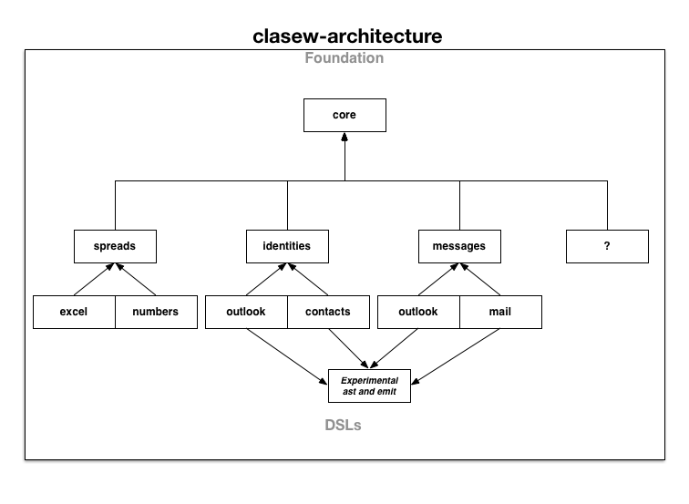

#clasew

A Clojure AppleScriptEngine Wrapper

##Intent

clasew provide an idiomatic clojure wrapper for Java ScriptManager, specifically AppleScriptManager,  and scriptable application DSLs for common usage.

##Architecture 0.2.1
As per the Intent, the clasew architecture is very straight forward.

###Foundation
Consists of the clasew.core namespace. Contains the raw functions for interacting with AppleScript.

###DSLs
Consists of clasew.*appname* namespaces where ***appname*** is collection of idiomatic functions specific to a scriptable application.

###Documentation

1. [Change Log](CHANGES.md)
2. [Foundation Introduction](doc/intro.md) - Recommended first read
3. [Generic spreadsheet DSL](doc/clasew-spreads.md)
4. [Numbers DSL](doc/clasew-numbers.md)
5. [Excel DSL](doc/clasew-excel.md)
6. [Identities DSL](doc/clasew-identities.md)

##Examples

All files located [here](dev/src/clasew)

1. [Example 1](dev/src/clasew/examples1.clj) - Demonstrates standard 'tell' calls
2. [Example 2](dev/src/clasew/examples2.clj) - Demonstrates handlers and argument passing
3. [Example 3](dev/src/clasew/examples3.clj) - Demonstrates separate argument bindings
4. [Example 4](dev/src/clasew/examples4.clj) - Demonstrates clasew-spreads and clasew-excel DSL
5. [Example 5](dev/src/clasew/examples5.clj) - Demonstrates clasew-spreads and clasew-numbers DSL
6. [Quarterly Sales Contrived Snippet](dev/src/clasew/quarters.clj) - Demonstrates a more realistic use for Excel and/or Numbers
7. [Example 7](dev/src/clasew/examples7.clj) - Demonstrates clasew-identities and clasew-outlook DSL
8. [Example 8](dev/src/clasew/examples8.clj) - Demonstrates clasew-identities and clasew-contacts DSL

My dev environment:

* Clojure 1.6
* Yosemite 10.10.4
* Oracle Java 1.8.0_31
* Lighttable 0.72

##License

Copyright © Frank V. Castellucci. All rights reserved.

Distributed under the Eclipse Public License (EPL) version 1.0.
