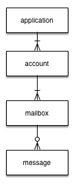

# Introduction to clasew.messages DSL

***clasew*** is based on a core set of primitives for calling AppleScript vis-a-vis the Java ScriptManager interop. The DSLs (delivered and planned) leverage these primitives to simplify the developer interface to targeted applications.

***clasew.messages*** is a DSL that builds on `clasew.core`. Go [here](intro.md) for more informaiton on `clasew.core`. The primary functionality that `clasew.messages` brings to the table is to abstract 99% of a generic email fetch and send managemenet DSL that is then finalized by  `clasew.outlook` or `clasew.mail` DSLs.

The focus of this page is to describe the higher order functions (HOF), found in the `clasew.messages` namespace, that can be utilized to simplify interacting with either Microsoft Outlook or Apple's Mail applications via AppleScript.

## clasew.messages
As noted in the introduction, the main functions in this namespace are HOFs that provide a DSL that, under the covers, call the clasew.core primitive functions.

### Namespace Initialization
When clasew.messages is loaded:
+ Establishes a local ```(defonce ...)``` engine for it's use

Unlike `clasew.core`, `clasew.messages` ***does not*** require providing an engine argument as it has a dedicated instance.

###Raw Materials

There are a number of message related forms that simplify the preperation of calling AppleScript for either the Outlook or Mail applications. The primary focus of these forms is on readying the script payload before calling out to the respective technollogy DSL.

#####clasew.identities/run-script!

This form is the core function that invokes AppleScript to execute one or more scripts. It takes as ***input*** the ***output*** from either `clasew.outlook/script or clasew.mail/script` functions.

```clojure
(defn run-script!
  "Invokes the AppleScript interpreter passing one or more scripts
  to be evaluated"
  [& scripts]
  (...)

```


####Filtering
The filtering functions have been moved to `clasew.ast-utils` and are [documented here](clasew-ast-utils.md). There are some restrictions on using filters at the function usage level.

#####Filter function applicability
The following table identifies where filters may be provided to modify a functions operation:

<table>
<tr><th>Function</th><th>Sub Function</th><th>Filter Supported</th></tr>
<tr><td>clasew.messages/accounts</td><td>na</td><td>Y</td></tr>
<tr><td>clasew.messages/mailboxes</td><td>na</td><td>Y</td></tr>
<tr><td>clasew.messages/messages</td><td>na</td><td>Y</td></tr>
<tr><td>clasew.messages/send-message</td><td>na</td><td>Y (subset)</td></tr>
</table>

#####Filter applied function restrictions
The following table identifies additional restrictions on using filters on various functions:

<table>
<tr><th>Application</th><th>Context</th><th>Restriction</th></tr>
<tr><td>All</td><td>`clasew.identities/accounts`</td><td>filter-expressions can only apply to account properties and not mailboxes or messages</td></tr>
<tr><td>All</td><td>`clasew.messages/mailboxes`</td><td>filter-expressions can only apply to mailbox properties and not accounts or messages</td></tr>
<tr><td>All</td><td>`clasew..messages/messages`</td><td>filter-expressions can only apply to message properties and not accounts or mailboxes</td></tr>
<tr><td>All</td><td>`clasew..messages/send-message`</td><td>filter-expressions can only apply to input `:msg_sender` attribute and must use the account properties only</td></tr>
</table>

####Fetching Message Data

The following data model is an abstraction of how `clasew.messages` views the world. Note the topological relationships as these are adhered to in the `clasew.messages` DSL.

#####Data Model



#####clasew.messages/accounts
This form may be used as ***input*** to the `clasew.APPLICATION/script` function, invoked for the target application, to fetch all, partial and/or filtered information for accounts.
```clojure
(defn accounts
  "Prepares the script for retrieving attributes of accounts from the message source
  application along with any additional sub-attributes. Also supports account filtering."
  [& args]
  (...)
```
The following is a breakdown of the arguments and variations
<table>
<tr><th>Argument</th><th>Description</th></tr>
<tr><td>keywords</td><td>(optional) Keywords identifying attributes of the account you want to return with the results. If omitted, attributes returned are defined by `clasew.messages/account-standard`.</tr>
<tr><td>map</td><td>(optional) Map produced from `clasew.messages/mailboxes`</td></tr>
<tr><td>filters</td><td>(optional) Contains filter designation to limit scope of accounts whose information is being fetched. See Filtering description and limitations above.</td></tr>
</table>

Here is a REPL ready examples. **Note that the output from the following are not runnable scripts but purely for demonstrating form results**:
```clojure
(ns clasew.sandbox
  (:require [clasew.messages :as mesg]
            [clasew.ast-utils :as astu]
            [clojure.pprint :refer :all])
  )

;;; Setup for the example

(def p pprint)

;;;
;;; Demonstrate most basic call
;;;

(p (mesg/accounts))

=> {:action :get-messages,
 :fetch-type :accounts,
 :args
 (:acct_user_name
  :acct_name
  :acct_user_fullname
  :acct_emails
  :acct_type),
 :filters nil,
 :subsets ()}

;;;
;;; Variants

; All accounts with their mailboxes

(p (mesg/accounts (mesg/mailboxes)))

=> {:action :get-messages,
 :fetch-type :accounts,
 :args
 (:acct_user_name
  :acct_name
  :acct_user_fullname
  :acct_emails
  :acct_type),
 :filters nil,
 :subsets
 ({:action :get-messages,
   :fetch-type :mailboxes,
   :args (:mb_message_count :mb_unread_message_count :mb_name),
   :filters nil,
   :subsets ()})}

; All account names only along with mailboxes

(p (mesg/accounts
    :acct_name
    (mesg/mailboxes)))

; All accounts, their mailboxes and all messages filtered
; by messages that have the sender name containing "irs.gov"
; Hopefully this returns nothing!

(p (mesg/accounts
    (mesg/mailboxes
     (mesg/messages
      (astu/filter :msg_sender astu/CT "irs.gov")
      :msg_subject
      :msg_read
      :msg_sender
      :msg_recipients
      :msg_date_sent
      :msg_date_recieved))))

=> {:action :get-messages,
 :fetch-type :accounts,
 :args
 (:acct_user_name
  :acct_name
  :acct_user_fullname
  :acct_emails
  :acct_type),
 :filters nil,
 :subsets
 ({:action :get-messages,
   :fetch-type :mailboxes,
   :args (:mb_message_count :mb_unread_message_count :mb_name),
   :filters nil,
   :subsets
   ({:action :get-messages,
     :fetch-type :messages,
     :args
     (:msg_subject
      :msg_read
      :msg_sender
      :msg_recipients
      :msg_date_sent
      :msg_date_recieved),
     :filters {:joins (), :args ((:msg_sender :contains "irs.gov"))},
     :subsets ()})})}
```
#####clasew.messages/mailboxes
This form may be used as ***input*** to the `clasew.APPLICATION/script` function, invoked for the target application, to fetch all, partial and/or filtered information for account mailboxes.
```clojure
(defn mailboxes
  "Prepares the script for retrieving attributes of mailboxes from the message source
  application along with any additional sub-attributes. Also supports mailbox filtering."
  [& args]
  (...)
```
The following is a breakdown of the arguments and variations
<table>
<tr><th>Argument</th><th>Description</th></tr>
<tr><td>keywords</td><td>(optional) Keywords identifying attributes of the account you want to return with the results. If omitted, attributes returned are defined by `clasew.messages/mailbox-standard`.</tr>
<tr><td>map</td><td>(optional) Map produced from `clasew.messages/messages`</td></tr>
<tr><td>filters</td><td>(optional) Contains filter designation to limit scope of accounts whose information is being fetched. See Filtering description and limitations above.</td></tr>
</table>

Here is a REPL ready examples. **Note that the output from the following are not runnable scripts but purely for demonstrating form results**:
```clojure
(ns clasew.sandbox
  (:require [clasew.messages :as mesg]
            [clasew.ast-utils :as astu]
            [clojure.pprint :refer :all])
  )

;;; Setup for the example

(def p pprint)

;;; Demonstrate most basic call

(mesg/mailboxes)

;;; Internally, clasew prepends accounts if missing. So the above is
;;; equivalent to

(mesg/accounts (mesg/mailboxes))

;;;
;;; Variants

; All mailboxes and their respective messages
; This could get big

(mesg/mailboxes (mesg/messages))

; Limit output to getting only name and unread count of mailbox

(mesg/mailboxes :mb_name :mb_unread_message_count)

; Filtering on inbox with unread messages!
; Mailbox names are application and case sensitive

(p (mesg/accounts
    (mesg/mailboxes
     (astu/filter :mb_name astu/EQ "Inbox"
     (mesg/messages
      (astu/filter :msg_read astu/EQ false)
      :msg_subject
      :msg_sender
      :msg_recipients
      :msg_date_sent))))
```

#####clasew.messages/messages
This form may be used as ***input*** to the `clasew.APPLICATION/script` function, invoked for the target application, to fetch all, partial and/or filtered information for account mailbox messages.
```clojure
(defn messages
  "Prepares the script for retrieving attributes of messages from the message source
  application along with any additional sub-attributes. Also supports message filtering."
  [& args]
  (...)
```
The following is a breakdown of the arguments and variations
<table>
<tr><th>Argument</th><th>Description</th></tr>
<tr><td>keywords</td><td>(optional) Keywords identifying attributes of the account you want to return with the results. If omitted, attributes returned are defined by `clasew.messages/message-standard`.</tr>
<tr><td>filters</td><td>(optional) Contains filter designation to limit scope of accounts whose information is being fetched. See Filtering description and limitations above.</td></tr>
</table>

#####clasew.messages/send-message
This form may be used as input to the `clasew.APPLICATION/script` function, invoked for the target application, to send email messages.

```clojure

;(def send-message-template
;  {:msg_sender     nil ; nil,email string or account filter to get email address
;   :msg_recipients []  ; currently support To: - A vector of email addresses
;   :msg_subject    nil ; String
;   :msg_text       nil ; String
;   })

(defn send-message
  "Prepares the script for sending email messages. Filters are supported
  on the :msg_sender attribute only. If :msg_sender is nil the default
  account (as defined by target application) will be used"
  [msg]
  (...)
```
The following is a breakdown of the arguments and variations
<table>
<tr><th>Argument</th><th>Description</th></tr>
<tr><td>msg</td><td>(map required) Refer to the send-message-template for attributes.</tr>
</table>


*For additional examples see the [Example 9](../dev/src/clasew/examples9.clj) source*

#####clasew.APPLICATION/script
(where Application is either the clasew.mail or clasew.outlook name spaces


```clojure
;;; Produce script output ready for input into clasew.messages/run-script!

(p (mesg/run-script!
    (clasew.outlook/script
     (mesg/accounts))
    (astu/quit :outlook)))

(mesg/run-script!
  (clasew.mail/script
    (mesg/send-message
     {:msg_sender "SENDER@SOMEWHERE.COM"
      :msg_recipients ["RECIPIENT1@SOMEWHERE.COM"
                     "RECIPIENT1@SOMEWHERE.COM"]
      :msg_text "This is the test"
      :msg_subject "Hey, look at this"})))

```


